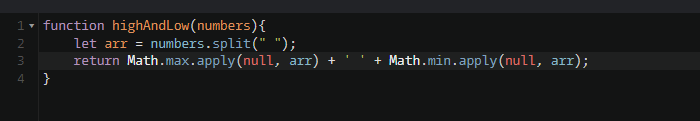
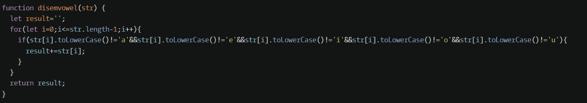
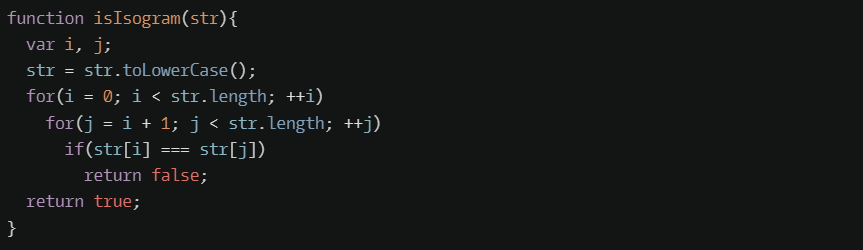
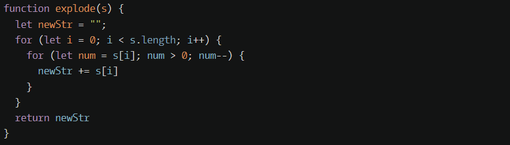
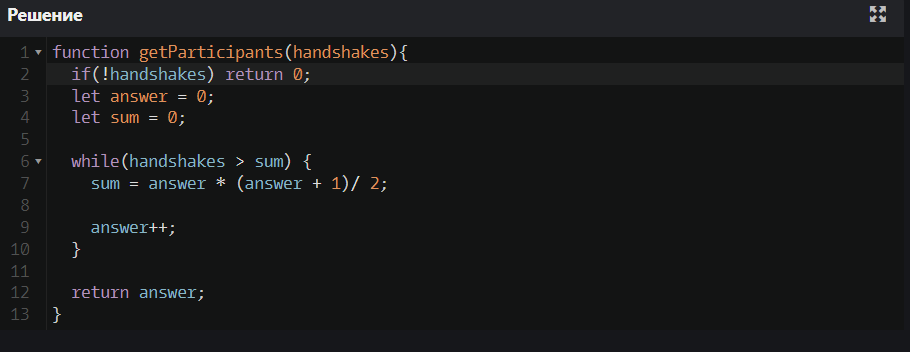
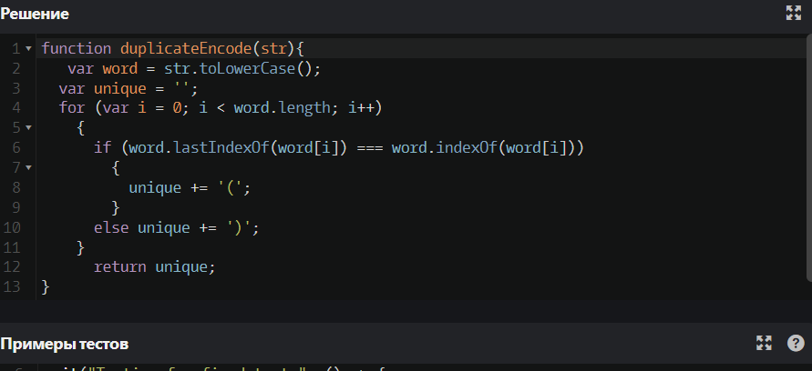
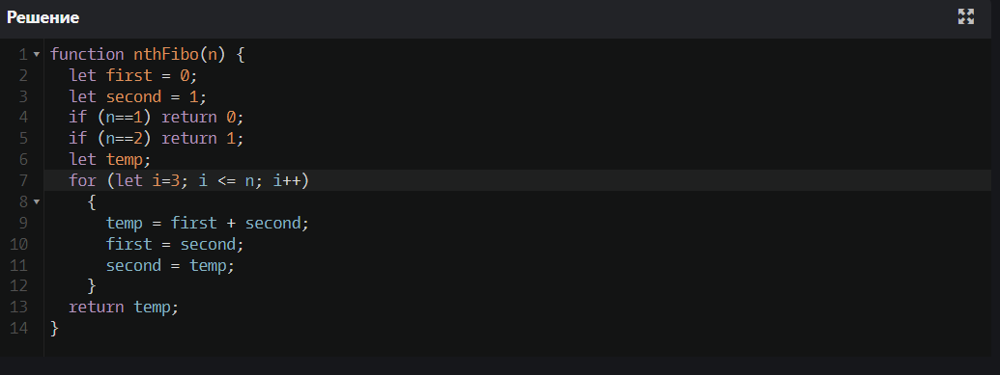
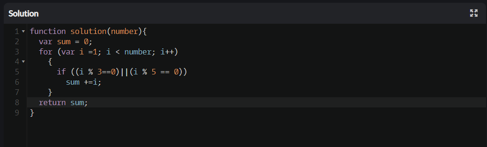

<p align = "center">МИНИСТЕРСТВО НАУКИ И ВЫСШЕГО ОБРАЗОВАНИЯ
РОССИЙСКОЙ ФЕДЕРАЦИИ
ФЕДЕРАЛЬНОЕ ГОСУДАРСТВЕННОЕ БЮДЖЕТНОЕ
ОБРАЗОВАТЕЛЬНОЕ УЧРЕЖДЕНИЕ ВЫСШЕГО ОБРАЗОВАНИЯ
«САХАЛИНСКИЙ ГОСУДАРСТВЕННЫЙ УНИВЕРСИТЕТ»</p>
<br>
<p align = "center">Институт естественных наук и техносферной безопасности</p>
<p align = "center">Кафедра информатики</p>
<p align = "center">Пашаян Самвел Алексанович</p>
<br>
<p align = "center">Лабораторная работа №3</p>
<p align = "center">01.03.02 Прикладная математика и информатика</p>
<br>
<p align = "right" >Научный руководитель</p>
<p align = "right" >Соболев Евгений Игоревич</p>
<p align = "center" >Южно-Сахалинск</p>
<p align = "center" >2022 г.</p>
<p align = "center" ><b>ВВЕДЕНИЕ</b></p>
<p> <b> JavaScript </b> — это язык программирования, который используют для написания frontend- и backend-частей сайтов, а также мобильных приложений. Часто в текстах и обучающих материалах название языка сокращают до JS. Это язык программирования высокого уровня, то есть код на нем понятный и хорошо читается.</p>
<p> JavaScript обычно используется как встраиваемый язык для программного доступа к объектам приложений. Наиболее широкое применение находит в браузерах как язык сценариев для придания интерактивности веб-страницам, для этого даже не требуется компиляция (перевод языка программирования в машинный код). Скрипты можно прописать внутри кода страницы или подключить к HTML отдельным файлом. 
Основные архитектурные черты: динамическая типизация, слабая типизация, автоматическое управление памятью, прототипное программирование, функции как объекты первого класса.</p>
<p align = "center" > РЕШЕНИЕ ЗАДАЧ (ОСНОВНАЯ ЧАСТЬ) </p>
 
 ```js 
        function z1()
        {
            alert( null || 2 || undefined );
        }
        function z2()
        {
            alert( alert(1) || 2 || alert(3) );
        }
        function z3()
        {
            alert( 1 && null && 2 );
        }
        function z4()
        {
            alert( alert(1) && alert(2) );
        }
        function z5()
        {
            alert( null || 2 && 3 || 4 );
        }
        function z6()
        {
            let age = prompt("Введите число ", "");
            if ((age>=14)&&(age<=90))
            {
                alert("age в диапозоне");
            }
            else {alert("Не в диапазоне");}
        }
        function z7()
        {
            let age = prompt("Введите число ", "");   
            if (!((age>=14)&&(age<=90)))
            {
                alert("age не в диапозоне");
            }
            if (((age<14)||(age>90)))
            {
                alert("age не в диапозоне");
            }
        }
        function z8()
        {
            if (-1 || 0) alert( 'first' );
            if (-1 && 0) alert( 'second' );
            if (null || -1 && 1) alert( 'third' );
        }
        function z9()
        {
            let login = prompt("Введите логин:", "");
            if (login == "Админ")
            {
                let password = prompt("Введите пароль:", "");
                if (password == "Я главный")
                {
                    alert("Здравствуйте!");
                }
                else if ((password == "")||(password == null))
                {
                    alert("Отменено");
                }
                else
                {
                    alert("Неверный пароль");
                }
            }
            else if ((login == "")||(login == null))
            {
                alert("Отменено");
            }
            else
            {
                alert("Я вас не знаю");
            }
        }
        function z10()
        {   
            let i = 3;
            while (i) 
            {
                alert( i-- );
            }
        }
        function z11()
        {
            alert("Префиксный вариант");
            let i = 0;
            while (++i < 5) alert( i );
            alert("Постфиксный вариант");
            i = 0;
            while (i++ < 5) alert( i );
        }
        function z12()
        {
            alert("Постфиксная форма");
            for (let i = 0; i < 5; i++) alert( i ); 
            alert("Префиксная форма");
            for (let i = 0; i < 5; ++i) alert( i );
        }
        function z13()
        {
            for (let i = 2; i <= 10; i++)
            {
                if (i % 2==0)
                {alert(i);}
            }
        }
        function z14()
        {
            let i=0;
            while (i < 3) 
            {
                alert( `number ${i}!` );
                i++;
            }
        }
        function z15()
        {
            let num = prompt("Введите число","");
            while (num<100)
            {
                num = prompt("Введите еще раз число, но больше этого","")
            }
            alert(num);
        }
        function z16()
        {
            let num = prompt("Введите конец интервала","");
            alert(2);
            for (let i=3;i<=num;i++)
            {
                let proverka = true;
                for (let j = 2; j < i; j++)
                {
                    if (i % j == 0)
                    {
                        proverka = false;
                        break;
                    }
                }
                if (proverka==true)
                {alert(i);}
            }
        }
        function z17()
        {
            let browser = prompt("Введите название браузера","");
            if (browser=='Edge')
            {alert( "You've got the Edge!" );}
            else if (browser=='Chrome')
            {alert( "You've got the Chrome!" );}
            else if(browser=='Firefox')
            {alert( "You've got the Firefox!" );}
            else if(browser=='Safari')
            {alert( "You've got the Safari!" );}
            else if(browser=='Opera')
            alert( 'Okay we support these browsers too' );
            else{alert( 'We hope that this page looks ok!' );}
        }
        function z18()
        {
            const number = +prompt('Введите число между 0 и 3', '');
            switch(number)
            {
                case 0:
                    alert('Вы ввели число 0');
                    break;
                case 1:
                    alert('Вы ввели число 1');
                    break;
                default:
                    alert('Вы ввели число 2, а может и 3');
                    break;
            }
        }
        function z19()
        {
            let vozrast = prompt('Введите ваш возраст', '');
            checkAge(vozrast);
        }
        function checkAge(age) 
        {
            if (age > 18) {
            return true;
            }
            // ...
            return confirm('Родители разрешили?');
        }
        function z20()
        {
            let vozrast = prompt('Введите ваш возраст', '');
            checkAge1(vozrast);
            checkAge2(vozrast);
        }
        function checkAge1(age) {
        return (age > 18) ? true : confirm('Родители разрешили?');
        }
        function checkAge2(age) {
        return (age > 18) || confirm('Родители разрешили?');
        }
        function z21()
        {
            let A = prompt("Введите число a","");
            let B = prompt("Введите число b","");
            alert(min(A,B));
        }
        function min(a,b)
        {
            if (a>b)
            {return b;}
            else{return a;}
        }
        function z22()
        {
            let x = prompt("Введите число x","");
            let n = prompt("Введите число n","");
            alert(pow(x,n));
        }
        function pow(x,n)
        {
            let chislo=1;
            for (let i = 0; i < n; i++)
            {
                chislo*=x;
            }
            return chislo;
        }
    

    <p> Задание 1 </p> <button type="button" onclick=z1()> Ответ </button>
     <p> Задание 2 </p> <button type="button" onclick=z2()> Ответ </button>
     <p> Задание 3 </p> <button type="button" onclick=z3()> Ответ </button>
     <p> Задание 4 </p> <button type="button" onclick=z4()> Ответ </button>
     <p> Задание 5 </p> <button type="button" onclick=z5()> Ответ </button>
     <p> Задание 6 </p> <button type="button" onclick=z6()> Ответ </button>
     <p> Задание 7 </p> <button type="button" onclick=z7()> Ответ </button>
     <p> Задание 8 </p> <button type="button" onclick=z8()> Ответ </button>
     <p> Задание 9 </p> <button type="button" onclick=z9()> Ответ </button>
     <p> Задание 10 </p> <button type="button" onclick=z10()> Ответ </button>
     <p> Задание 11 </p> <button type="button" onclick=z11()> Ответ </button>
     <p> Задание 12 </p> <button type="button" onclick=z12()> Ответ </button>
     <p> Задание 13 </p> <button type="button" onclick=z13()> Ответ </button>
     <p> Задание 14 </p> <button type="button" onclick=z14()> Ответ </button>
     <p> Задание 15 </p> <button type="button" onclick=z15()> Ответ </button>
     <p> Задание 16 </p> <button type="button" onclick=z16()> Ответ </button>
     <p> Задание 17 </p> <button type="button" onclick=z17()> Ответ </button>
     <p> Задание 18 </p> <button type="button" onclick=z18()> Ответ </button>
     <p> Задание 19 </p> <button type="button" onclick=z19()> Ответ </button>
     <p> Задание 20 </p> <button type="button" onclick=z20()> Ответ </button>
     <p> Задание 21 </p> <button type="button" onclick=z21()> Ответ </button>
     <p> Задание 22 </p> <button type="button" onclick=z22()> Ответ </button>
```
<p><b>23</b></p>

<p><b>24</b></p>

<p><b>25</b></p>

<p><b>26</b></p>

<p><b>27</b></p>

<p><b>28</b></p>

<p><b>29</b></p>

<p><b>30</b></p>

<p align = "center" > ВЫВОД </p>
<p> Итогом работы стало создание странички с использованием языка JS. В ходе выполнения задания, мною были решены все выдвинутые задачи, сформулированные исходя из цели лабораторной работы, и в которых нужно было написать функции, выполняющие то или иное действие при помощи различного применения циклов и условий. Это позволяет сделать вывод, что цель данной лабораторной работы успешно достигнута. </p>